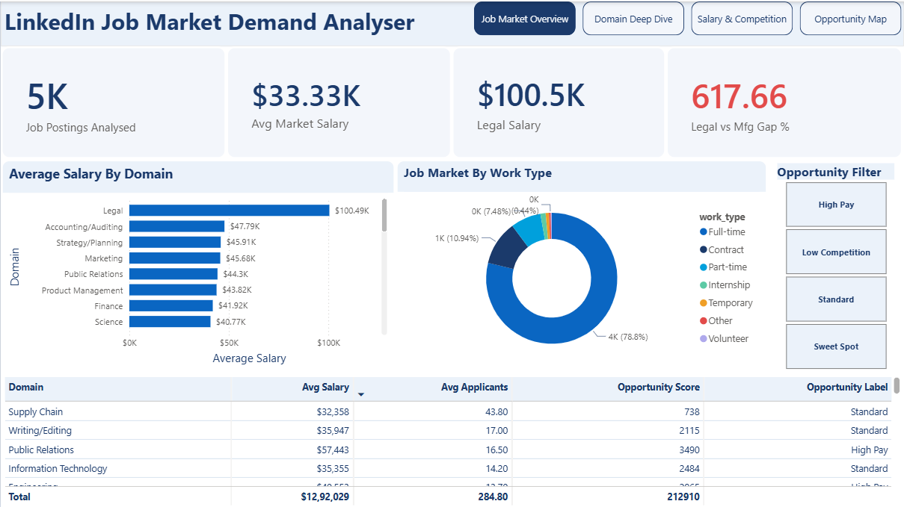
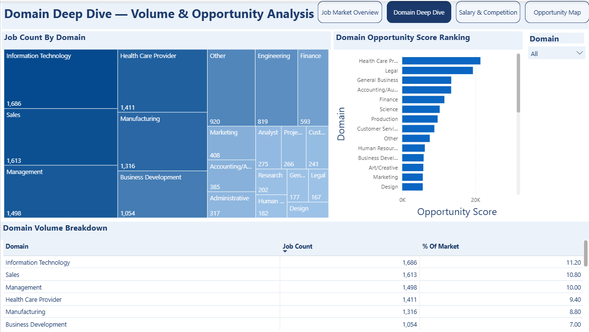
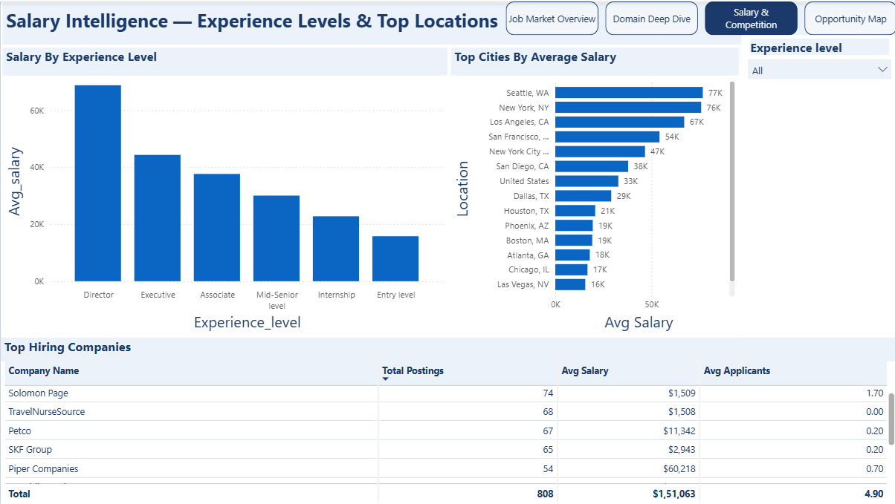
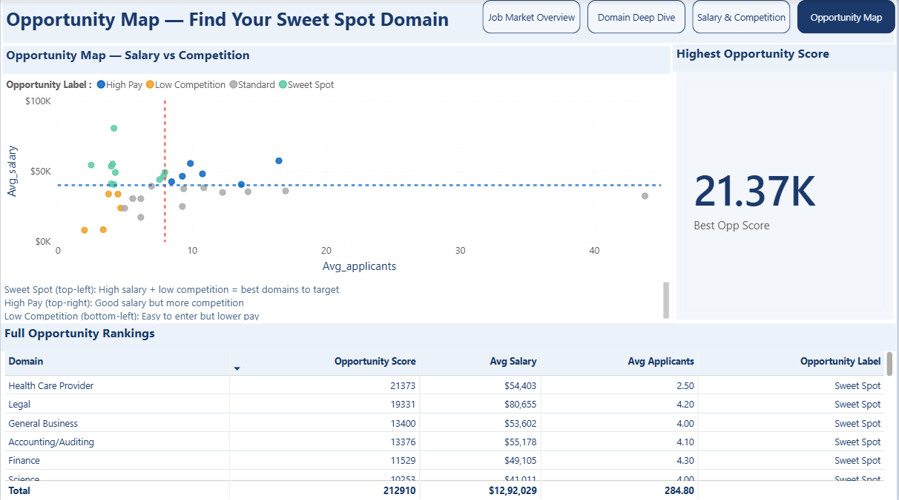

# 📊 LinkedIn Job Market Demand Analyser

> **Which job domains are worth targeting — and which ones are a trap?**  
> I analysed 5,000+ LinkedIn job postings across 33 domains to find out.



---

## 📊 Dashboard Preview
> Built with Power BI Desktop — 4 interactive pages with DAX measures, 
> slicers, scatter chart with quadrant lines, and opportunity scoring.  
> Full `.pbix` file available in the `/powerbi/` folder — open with Power BI Desktop (free).

> 📸 Screenshots of all 4 pages below in the Dashboard Screenshots section.

---

## 📌 Project Overview

| Item | Detail |
|------|--------|
| **Business Question** | Which domains offer the best salary-to-competition ratio? |
| **Dataset** | LinkedIn Job Postings 2023–2024 — Kaggle (33,000+ raw postings) |
| **Tools Used** | Python · MySQL · Excel · Power BI |
| **Tables** | 5 related tables (job_postings, job_skills, companies, salaries, job_industries) |
| **SQL Queries** | 8 analysis queries |
| **Dashboard Pages** | 4 pages (Overview, Domain Deep Dive, Salary & Competition, Opportunity Map) |

---

## ❓ Business Questions Answered

1. Which job domains have the most postings?
2. How is the market split between work types?
3. How does salary vary by experience level?
4. Which cities offer the most jobs and best pay?
5. Which companies are hiring most aggressively?
6. Which domains pay the highest average salary?
7. Which domains have the most competition per posting?
8. Which domains have the best salary-to-competition opportunity score?

---

## 🔑 Key Findings

- **Legal** roles pay **$100,487** avg — **7.2x more** than Manufacturing ($14,002) in the same market
- **Supply Chain** has the **highest competition** (43.8 applicants/job) yet ranks 26th out of 33 in salary
- **Full-time** roles attract only **2.4 applicants/job** vs Contract's 8.9 — same pay, 3.7x less competition
- **Entry → Associate** level is the biggest salary jump: **+138%** ($15,788 → $37,638)
- **Seattle** pays the highest avg salary ($76,697) of all major cities analysed
- **Health Care Provider** has the highest opportunity score (21,373) — high salary, low competition

---

## 🛠️ Project Structure

```
linkedin-job-market-analysis/
├── README.md
├── data/
│   └── processed/               ← 8 query result CSVs
│       ├── q1_domain_demand.csv
│       ├── q2_work_type.csv
│       ├── q3_salary_experience.csv
│       ├── q4_locations.csv
│       ├── q5_companies.csv
│       ├── q6_domain_salary.csv
│       ├── q7_competition.csv
│       └── q8_opportunity_score.csv
├── python/
│   └── data_cleaning.ipynb      ← Step 1: automated cleaning of 5 raw CSVs
├── sql/
│   └── analysis_queries.sql     ← Step 2: 8 analysis queries
├── excel/
│   └── LinkedIn_JobMarket_Analysis_v2.xlsx  ← Step 3: KPI workbook
├── powerbi/
│   └── LinkedIn_JobMarket_Dashboard.pbix    ← Step 4: 4-page dashboard
├── screenshots/
│   ├── dashboard_overview.png
│   ├── dashboard_domains.png
│   ├── dashboard_salary.png
│   └── dashboard_opportunity.png
└── insights/
    └── business_recommendations.md          ← Step 5: written findings
```

---

## 🐍 Python — Data Cleaning

Automated cleaning of 5 raw Kaggle CSVs using Pandas before loading into MySQL.

**What the script does:**
- Removed 18 unnecessary columns from job_postings (kept 13 required ones)
- Fixed `listed_time` scientific notation issue — `1.7134E+12` → `1713400000000`
- Mapped 35 domain abbreviations to full names using `skills.csv` mapping file
- Removed rows with missing critical fields, fixed data types, trimmed to analysis size

```python
# Load domain mapping from skills.csv
df_map = pd.read_csv("raw_data/skills.csv")
domain_map = dict(zip(df_map['skill_abr'].str.strip(),
                      df_map['skill_name'].str.strip()))

# Map abbreviations to full domain names
df['skill_abr'] = df['skill_abr'].str.strip().map(domain_map)
```

**Output:**

| File | Rows | Columns |
|------|------|---------|
| job_postings_clean.csv | 5,000 | 13 |
| job_skills_clean.csv | 15,000 | 2 |
| companies_clean.csv | 3,000 | 5 |
| salaries_clean.csv | 4,000 | 8 |
| job_industries_clean.csv | 5,000 | 2 |

---

## 🗄️ SQL Analysis

8 queries written in MySQL covering domain demand, salary benchmarks, competition levels and opportunity scoring.

**Domain salary ranking with RANK() window function:**
```sql
SELECT
  js.domain,
  COUNT(DISTINCT js.job_id) AS job_count,
  ROUND(AVG(CAST(jp.normalized_salary AS DECIMAL(12,2))), 0) AS avg_salary,
  RANK() OVER (ORDER BY AVG(CAST(jp.normalized_salary AS DECIMAL(12,2))) DESC) AS salary_rank
FROM job_skills js
JOIN job_postings jp ON js.job_id = jp.job_id
WHERE jp.normalized_salary IS NOT NULL
  AND jp.normalized_salary != ''
GROUP BY js.domain
HAVING COUNT(DISTINCT js.job_id) > 20
ORDER BY avg_salary DESC;
```

**Opportunity Score — salary divided by competition:**
```sql
ROUND(
  AVG(CAST(jp.normalized_salary AS DECIMAL(12,2))) /
  NULLIF(AVG(CAST(jp.applies AS DECIMAL(10,2))), 0)
, 0) AS opportunity_score
```

---

## 📊 Dashboard Screenshots

| Page | Preview |
|------|---------|
| Job Market Overview |  |
| Domain Deep Dive |  |
| Salary & Competition |  |
| Opportunity Map |  |

---

## 💡 Business Recommendations

Full written recommendations → [insights/business_recommendations.md](insights/business_recommendations.md)

**Top 3 actions based on data:**
1. Target **Legal or Finance** domains — highest salary ($100K+), lowest competition (4.2 applicants/job)
2. Apply to **Full-time** roles only — same salary as Contract, 3.7x fewer applicants
3. Focus on **New York or Seattle** — highest salary cities with strong job volume

---

## 🛠️ Tools Used

| Tool | Purpose |
|------|---------|
| Python (Pandas) | Automated data cleaning of 5 raw CSVs |
| MySQL | Data loading, 8 SQL analysis queries |
| Microsoft Excel | KPI scorecard, XLOOKUP domain lookup model, pivot analysis |
| Power BI | 4-page interactive dashboard with DAX measures |

---

## 👤 About

**Sahil Kadu** — Aspiring Data Analyst · Pune, India  
Skills: Python · SQL · Excel · Power BI  
📧 sahilkadu10900@gmail.com  


---

*Dataset: [LinkedIn Job Postings 2023–2024](https://www.kaggle.com/datasets/arshkon/linkedin-job-postings) by arshkon on Kaggle*
